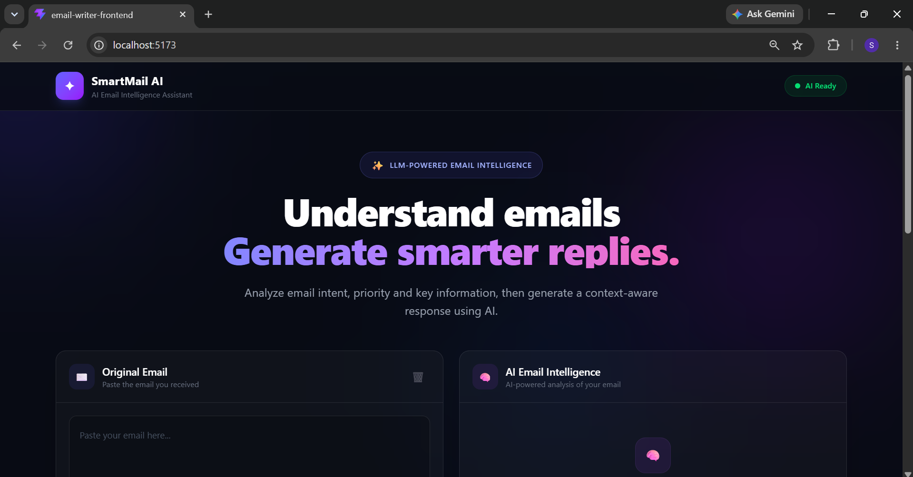
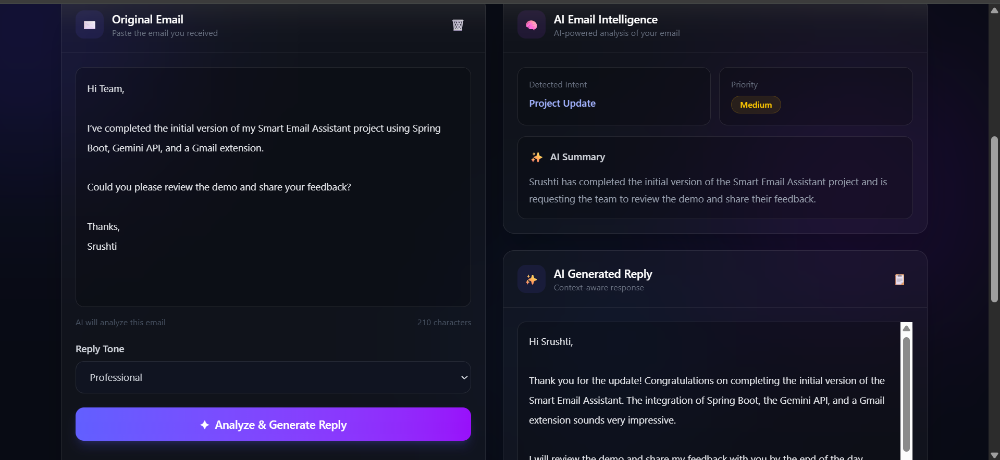
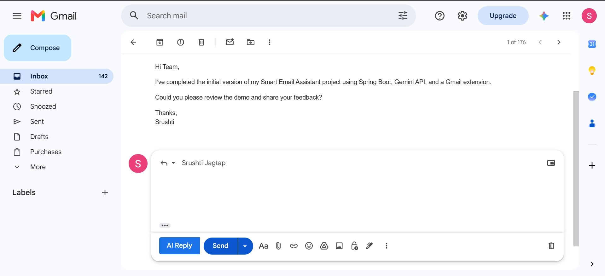
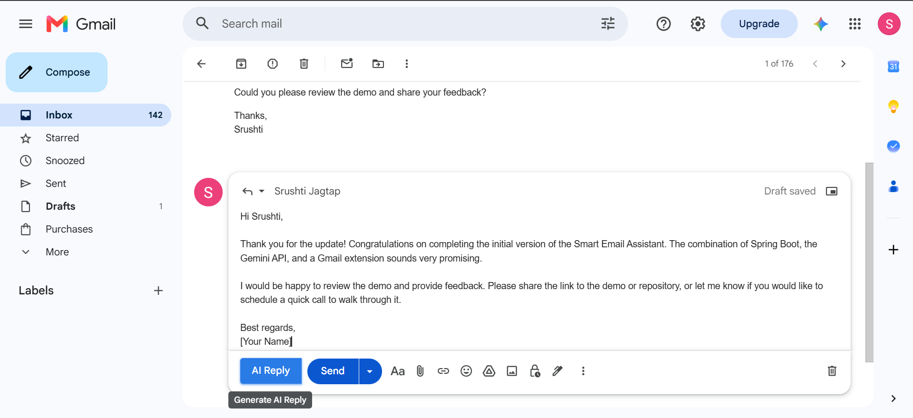

# 📧 SmartMail AI

An AI-powered email assistant that generates professional replies and analyzes email content using Google's Gemini API — integrated directly into Gmail through a Chrome Extension.


## 🎥 Demo

▶️ [Watch the Demo Video](https://drive.google.com/file/d/1HsVyTENPQtCec7cFyK9E6mNxNMEcGuQJ/view?usp=sharing)

## 📌 Overview

SmartMail AI has three components:

| Component | Role |
|---|---|
| **Spring Boot Backend** | REST API that talks to the Gemini API |
| **React Frontend** | Web UI to enter an email and view the AI response |
| **Gmail Chrome Extension** | Adds an "AI Reply" button inside Gmail |

Given an email, the backend returns a **reply**, **summary**, **intent**, and **priority**.

## ✨ Features

- 🤖 Context-aware AI reply generation (Gemini API)
- 📧 One-click "AI Reply" button inside Gmail
- 📝 Automatic email summarization
- 🎯 Intent detection (Meeting Request, Follow-up, Job Opportunity, etc.)
- 🚨 Priority classification — High / Medium / Low
- 🎨 Adjustable reply tone (e.g. professional)
- 🔐 API key secured via environment variables, never hardcoded

## 🖥️ Screenshots

### Frontend (Web App)

| Dashboard | Generated Reply & Analysis |
|---|---|
|  |  |

### Gmail Extension

| AI Reply Button in Gmail | AI Reply Inserted in Compose Box |
|---|---|
|  |  |

## 🏗️ How It Works

```text
React App / Gmail Extension
          ↓  POST /api/email/generate
    Spring Boot REST API
          ↓
       Gemini API
          ↓
  Reply · Summary · Intent · Priority
          ↓
React App / Gmail Extension
```

**Web flow:** enter email → select tone → backend calls Gemini → reply, summary, intent, and priority shown in the UI.

**Gmail flow:** extension detects the compose box → injects "AI Reply" button → on click, extracts email → sends to backend → inserts the generated reply into the compose box.

## 🛠️ Tech Stack

| Layer | Technology |
|---|---|
| Backend | Java, Spring Boot, WebClient, Lombok |
| Frontend | React, Vite, Tailwind CSS, Axios |
| AI | Google Gemini API |
| Gmail Integration | Chrome Extension (Manifest V3), Fetch API |
| Build / VCS | Maven, Git & GitHub |

## 🔌 API

**POST** `/api/email/generate`

```json
// Request
{ "emailContent": "Hi, wanted to share a project update...", "tone": "professional" }

// Response
{
  "reply": "Hi, thank you for the update...",
  "summary": "Sender shared a project update and asked for feedback.",
  "intent": "Project Update",
  "priority": "Medium"
}
```

## 📂 Project Structure

```text
smartmail-ai/
├── backend/            # Spring Boot API
├── frontend/            # React + Vite web app
├── gmail-extension/     # Chrome Extension (Manifest V3)
├── screenshots/
└── README.md
```

## 🔐 Environment Variables

```env
GEMINI_API_URL=your_gemini_api_endpoint
GEMINI_API_KEY=your_gemini_api_key
FRONTEND_URL=http://localhost:5173
```

## 🚀 Run Locally

**Prerequisites:** Java 21, Maven, Node.js, npm, Chrome, a Gemini API key

```bash
git clone https://github.com/Jagtap-Srushti/SmartMail-AI-Assistant.git
```

**Backend**
```bash
cd email-writer-backend
mvn spring-boot:run   # http://localhost:8080
```

**Frontend**
```bash
cd email-writer-frontend
npm install
npm run dev            # http://localhost:5173
```

**Gmail Extension**
1. Go to `chrome://extensions`
2. Enable **Developer mode**
3. Click **Load unpacked** → select the `EMAIL-WRITER-EXT` folder
4. Open Gmail — the **AI Reply** button will appear in compose


## 👩‍💻 Author

**Srushti Jagtap** — B.E. Computer Engineering

## 📄 License

Created for educational and portfolio purposes.
